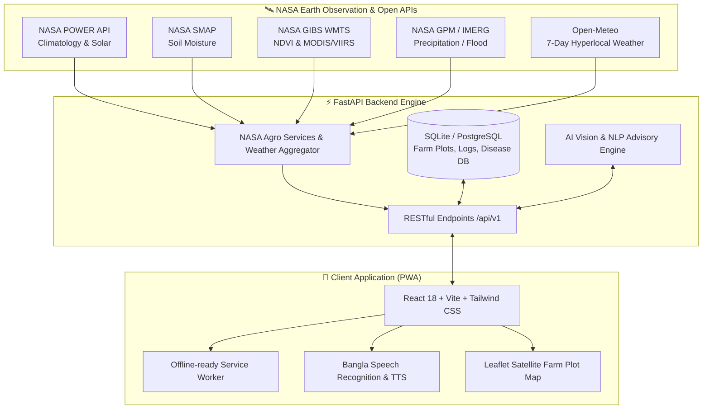

# 🌾 Crop Care (কৃষি বন্ধু) — NASA Agro-Intelligence PWA

[](https://www.spaceappschallenge.org/)
[](https://fastapi.tiangolo.com/)
[](https://react.dev/)
[](https://vitejs.dev/)
[](https://tailwindcss.com/)
[](LICENSE)

> **Empowering smallholder farmers across Bangladesh with NASA Earth Observation Satellite Data, Climatology Models, Real-Time Agro-Meteorology, and AI-Driven Crop Diagnosis.**

---

## 📌 Table of Contents
- [Project Overview](#-project-overview)
- [The Problem & Impact](#-the-problem--impact)
- [How NASA Earth Science Data is Used](#-how-nasa-earth-science-data-is-used)
- [Key Features & Innovations](#-key-features--innovations)
- [System Architecture](#-system-architecture)
- [Tech Stack](#-tech-stack)
- [Project Directory Structure](#-project-directory-structure)
- [Getting Started & Installation](#-getting-started--installation)
  - [Prerequisites](#prerequisites)
  - [Backend Setup (FastAPI)](#backend-setup-fastapi)
  - [Frontend Setup (React + Vite)](#frontend-setup-react--vite)
- [API Documentation & Endpoints](#-api-documentation--endpoints)
- [Localized Agro Specifications](#-localized-agro-specifications)
- [Future Roadmap](#-future-roadmap)
- [Contributors & Acknowledgments](#-contributors--acknowledgments)

---

## 🌍 Project Overview

**Crop Care (কৃষি বন্ধু)** is an end-to-end, Progressive Web Application (PWA) created for the **NASA Space Apps Challenge 2026**. Designed specifically for Bangladeshi smallholder farmers, it bridges the gap between sophisticated space-borne Earth science datasets and grassroots agricultural decision-making.

By turning raw satellite observations (precipitation, soil moisture, solar irradiance, vegetation health) into actionable, localized Bangla advisories and speech synthesis (TTS/STT), **Crop Care** ensures that even marginalized and low-literacy farmers can protect their harvest, reduce operational costs, and boost yields.

---

## ⚠️ The Problem & Impact

- **Climate Uncertainty & Extreme Weather**: Bangladeshi agriculture is heavily impacted by erratic monsoons, upstream flash floods in the Haor belt, sudden heatwaves, and droughts.
- **Resource Wastage**: Excessive irrigation and diesel consumption due to lack of accurate root-zone soil moisture indicators.
- **Pesticide Misuse & Loss**: Farmers frequently spray pesticides right before heavy rainfall or during high wind speeds, causing chemical runoff, environmental pollution, and unnecessary financial losses.
- **Lack of Climate Loss Verification**: Marginalized farmers face bureaucratic hurdles claiming micro-insurance or relief without verifiable parametric historical climate data.
- **Language & Literacy Barrier**: Most modern satellite dashboards are complex, academic, and presented exclusively in English.

---

## 🛰️ How NASA Earth Science Data is Used

Crop Care directly taps into NASA Earth Data APIs and remote sensing products:

| NASA Dataset / Product | Source / Sensor | Application in Crop Care |
|---|---|---|
| **NASA POWER Agroclimatology** | LaRC POWER API (`PRECTOTCORR`, `T2M`, `ALLSKY_SFC_SW_DWN`) | 20+ year baseline analysis of rainfall, solar radiation, and temperature for climate-resilient sowing windows. |
| **NASA SMAP** | Soil Moisture Active Passive (`GWETTOP` / Root-zone) | Precision irrigation scheduling, calculating water deficit vs. soil wetness to conserve groundwater and pump diesel costs. |
| **NASA GIBS WMTS** | Global Imagery Browse Services (MODIS / VIIRS NDVI) | Near real-time satellite imagery layer for vegetation vigour inspection and weak crop health zones. |
| **NASA GPM / IMERG** | Global Precipitation Measurement (Runoff / Upstream) | Flash flood early warning systems for river basins and low-lying Haor districts. |
| **NASA Parametric Proof** | Earth Data Time-Series Validation | Automated climate hazard event verification reports for financial institutions & crop insurance claims. |

---

## ✨ Key Features & Innovations

### 1. 🌦️ Unified Agro-Weather & Smart Spray Shield
- Real-time 7-day hyperlocal forecast combined with **NASA Climatology anomalies**.
- **Automated Spray Advisory**: Calculates rain probability within 4–6 hours, wind speed thresholds, and leaf moisture to warn farmers against premature pesticide application.
- Correct native Bengali calendar and localized weekday mappings.

### 2. 🌱 NASA Climatology-Powered Planting Advisor
- Compares current environmental parameters against 20-year climatological distributions.
- Determines the **ideal planting window**, warning farmers of post-sowing drought stress or monsoon waterlogging.

### 3. 💧 Smart Irrigation & Diesel Saving Scheduler (NASA SMAP)
- Analyzes root-zone soil moisture metrics to recommend exact irrigation depth and hours.
- Estimates diesel fuel and electricity cost savings per Bigha.

### 4. 🌊 Haor & Upstream Flash Flood Early Warning (GPM IMERG)
- Monitors upstream torrential precipitation in northeastern catchments to provide 7-day flash-flood runoff advisories for Boro and Aman rice growers.

### 5. 🔬 Crop Doctor & AI Disease Diagnosis
- Leaf photograph analysis powered by vision AI.
- Prioritizes **eco-friendly & biological treatments** before chemical pesticides.
- Displays chemical generic formulations, proper dosages, Pre-Harvest Intervals (PHI), and cost calculations per Bigha.

### 6. 📜 Parametric Climate Loss Certificate
- Instant generation of tamper-evident loss proof for bank loans and crop insurance.
- Correlates reported field damage with NASA historical precipitation, heat index, and storm anomalies.

### 7. 🗣️ Accessibility-First Bangla Voice Assistant
- Native Text-to-Speech (TTS) readout for every advisory card.
- Speech-to-Text (STT) voice input and AI conversational agent tailored for dialect understanding.

### 8. 🗺️ NASA GIBS Interactive Plot Health Map
- Interactive geospatial plot boundaries (GeoJSON polygon tracking) rendered on Leaflet with NDVI vegetation overlay.

---

## 🏛️ System Architecture



---

## 💻 Tech Stack

### **Frontend**
- **Framework**: [React 18](https://react.dev/) with [Vite](https://vitejs.dev/)
- **Styling**: [Tailwind CSS](https://tailwindcss.com/) with Glassmorphic Emerald UI
- **Maps & Geospatial**: [Leaflet](https://leafletjs.com/) & [React-Leaflet](https://react-leaflet.js.org/)
- **Visualizations**: [Recharts](https://recharts.org/)
- **Icons**: [Lucide React](https://lucide.dev/)
- **Accessibility**: Web Speech API (Bangla TTS/STT engine) & Mobile PWA manifest

### **Backend**
- **Framework**: [FastAPI](https://fastapi.tiangolo.com/) (Python 3.10+)
- **Server**: [Uvicorn](https://www.uvicorn.org/) (ASGI)
- **Database & ORM**: [SQLAlchemy](https://www.sqlalchemy.org/) with SQLite / PostgreSQL
- **HTTP Client**: [HTTPX](https://www.python-httpx.org/) (Async requests for NASA APIs)
- **Data Validation**: [Pydantic V2](https://docs.pydantic.dev/)

---

## 📂 Project Directory Structure

```
NASA SPACE APP CHALLENGE 2026/
├── backend/
│   ├── app/
│   │   ├── config.py                 # Configuration, API keys, and environment settings
│   │   ├── database.py               # Database engine & session management
│   │   ├── main.py                   # FastAPI entry point, middleware & route loader
│   │   ├── models/
│   │   │   └── models.py             # User, Plot, Activity, Expense, and Disease models
│   │   ├── data/
│   │   │   ├── crop_calendar.json    # 20-Year agro-climatology & crop calendars
│   │   │   └── disease_db.json       # Crop pathology, biological remedy & chemical PHI DB
│   │   ├── services/
│   │   │   ├── nasa_service.py       # NASA POWER API & GIBS satellite integration
│   │   │   ├── nasa_agro_service.py  # Advanced SMAP, GPM & Insurance certificate logic
│   │   │   ├── weather_service.py    # Open-Meteo aggregation & spray risk assessment
│   │   │   ├── planting_advisor.py   # Historical climate window optimizer
│   │   │   ├── disease_service.py    # Vision diagnostic & dosage calculator
│   │   │   └── expense_service.py    # Farm diary analytics & break-even ROI engine
│   │   └── routers/
│   │       ├── auth.py               # User registration and authentication
│   │       ├── plots.py              # Land plot management & GeoJSON boundaries
│   │       ├── weather.py            # Hyperlocal weather & spray alert endpoints
│   │       ├── planting.py           # Sowing calendar advisories
│   │       ├── disease.py            # AI Crop Doctor diagnosis
│   │       ├── diary.py              # Activity tracker & expense management
│   │       ├── satellite.py          # NASA GIBS satellite tiles & layers
│   │       ├── nasa_features.py      # Irrigation, flood warning, and certificates
│   │       └── chat.py               # Bangla agro voice/chat assistant
│   ├── seed_data.py                  # Demo seed generator (Mymensingh 3.5 Bigha demo)
│   ├── requirements.txt              # Backend Python dependencies
│   └── .env.example                  # Environment variable blueprint
├── frontend/
│   ├── src/
│   │   ├── components/               # Navbar, WeatherCard, LandHealthCard, TopAlertBanner...
│   │   ├── contexts/                 # LanguageContext (BN/EN), VoiceContext (TTS/STT)
│   │   ├── pages/                    # Dashboard, Planting, Disease, Diary, Satellite, Chat...
│   │   ├── utils/                    # Bangla numbers, translations, and API helpers
│   │   ├── index.css                 # Emerald Glassmorphic Agro Theme
│   │   ├── App.jsx                   # Application router and layout
│   │   └── main.jsx                  # React application root
│   ├── public/                       # Icons and PWA Web Manifest (`manifest.json`)
│   ├── index.html                    # HTML document entry
│   ├── package.json                  # Frontend dependencies and scripts
│   ├── tailwind.config.js            # Tailwind styling tokens
│   └── vite.config.js                # Vite build settings
└── README.md                         # Project documentation
```

---

## 🚀 Getting Started & Installation

### Prerequisites
- **Python**: Version `3.10` or higher
- **Node.js**: Version `18.x` or higher
- **Git**

### Backend Setup (FastAPI)

1. Open your terminal and navigate to the `backend` directory:
   ```bash
   cd backend
   ```

2. Create and activate a Python virtual environment:
   ```bash
   # Windows (PowerShell)
   python -m venv venv
   .\venv\Scripts\Activate.ps1

   # Linux / macOS
   python3 -m venv venv
   source venv/bin/activate
   ```

3. Install required dependencies:
   ```bash
   pip install -r requirements.txt
   ```

4. *(Optional)* Configure your environment variables:
   ```bash
   cp .env.example .env
   ```

5. Seed demo data (Pre-configured demo with a 3.5 Bigha Aman rice plot in Mymensingh):
   ```bash
   python seed_data.py
   ```

6. Start the FastAPI development server:
   ```bash
   uvicorn app.main:app --host 0.0.0.0 --port 8000 --reload
   ```
   - **Backend API**: `http://localhost:8000`
   - **Interactive Swagger Docs**: `http://localhost:8000/docs`
   - **Alternative ReDoc**: `http://localhost:8000/redoc`

---

### Frontend Setup (React + Vite)

1. Open a new terminal window and navigate to the `frontend` directory:
   ```bash
   cd frontend
   ```

2. Install npm dependencies:
   ```bash
   npm install
   ```

3. Start the Vite development server:
   ```bash
   npm run dev
   ```

4. Open your browser and visit:
   ```
   http://localhost:5173
   ```

---

## 📡 API Documentation & Endpoints

| Method | Endpoint | Description |
|---|---|---|
| `GET` | `/api/v1/weather/current` | Current weather with NASA spray risk indices |
| `GET` | `/api/v1/planting/advisor` | NASA POWER 20-year climatology planting recommendations |
| `GET` | `/api/v1/nasa-features/irrigation-advisor` | NASA SMAP soil moisture & diesel-saving pump schedule |
| `GET` | `/api/v1/nasa-features/flash-flood-warning` | NASA GPM / IMERG 7-day upstream flood alert |
| `POST` | `/api/v1/nasa-features/insurance-certificate` | Automated climate disaster certificate generation |
| `GET` | `/api/v1/nasa-features/community-pest-radar` | Crowdsourced local pest and outbreak radar |
| `POST` | `/api/v1/disease/diagnose` | AI leaf image diagnosis with PHI & treatment |
| `GET` | `/api/v1/plots/` | User farm plots with geospatial boundaries |
| `GET` | `/api/v1/diary/summary` | Farm expense logging and ROI break-even analysis |

---

## 🌾 Localized Agro Specifications

Crop Care includes full native conversion systems tailored to the Bangladesh agricultural ecosystem:
- **Land Measurement Units**: Bigha (বিঘা = ৩৩ শতক), Katha (কাঠা = ১.৬৫ শতক), Acre (একর = ১০০ শতক), Decimal (শতক).
- **Yield & Produce Weights**: Mon (মণ = ৪০ কেজি), Kg (কেজি).
- **Crop Calendars Supported**: Aus, Aman (BRRI dhan 49, BRRI dhan 51), Boro (BRRI dhan 28, 29), Potato (Diamant, Cardinal), Jute (O-9897), Mustard (BARI Sarisha 14), and Winter Vegetables.

---

## 🔮 Future Roadmap

- [ ] **Offline-First SQLite Sync**: Background synchronization for areas with intermittent mobile cellular connectivity.
- [ ] **USSD / IVR Integration**: Interactive voice response service for non-smartphone users.
- [ ] **Sentinel-2 High-Resolution Surface Reflectance**: Sub-10m NDVI resolution for individual plot micro-zones.
- [ ] **Direct Market Linkage**: Connecting smallholders directly to agricultural cooperatives to eliminate predatory middlemen.

---

## 👥 Contributors & Acknowledgments

Developed with ❤️ for the **NASA Space Apps Challenge 2026**.

- **NASA Earth Science Division** & **NASA POWER Project** for providing accessible Earth observation data.
- **NASA GIBS** & **Earthdata** for satellite visualization pipelines.
- **Bangladesh Rice Research Institute (BRRI)** & **BARI** for localized crop and agro-climatic advisories.

---

## 📄 License

This project is licensed under the [MIT License](LICENSE) — free and open-source for community and agricultural development.
